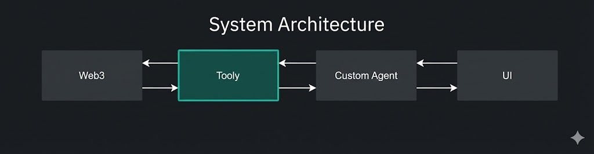
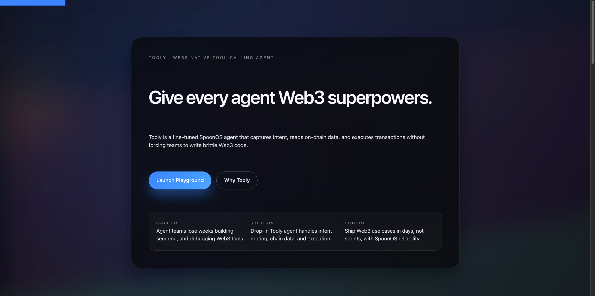

# Tooly 🛠️ Web3 Native Tool Calling Agent
## Powered by [SpoonOS](https://github.com/XSpoonAi)

[](https://tooly-279g.vercel.app/)
[](https://www.python.org)
[](https://fastapi.tiangolo.com)
[](https://github.com/XSpoonAi)
---
<div align="center">
  
</div>

## 🎥 Demo Video

[](https://youtu.be/nzaS1CS1trA)

### 🎯 Core Features

- **🤖 Dual-Agent Architecture**: UserAgent (AI routing) + SpoonOS (tool execution)
- **💬 Natural Language Interface**: Chat with your blockchain - just ask in plain English
- **🔧 21+ Web3 Tools**: Price data, swaps, gas estimates, OHLCV charts, GitHub analysis
- **⚡ Multi-Chain Support**: Ethereum, Neo, Binance Smart Chain, and more
- **🎨 Modern UI**: Clean, responsive interface with real-time updates

### 🛠️ Key Capabilities

| Category | Tools |
|----------|-------|
| **Crypto Data** | Price lookup, 24h stats, balance checks |
| **PowerData** | OHLCV/Kline data from major exchanges (Binance, OKX) |
| **EVM Operations** | Gas estimates, token swaps, bridges, transfers |
| **Neo Blockchain** | Neo-specific operations and queries |
| **Developer Tools** | GitHub repo analysis and insights |

---

## 🚀 Quick Start

### 📦 Installation

```bash
# Clone repository
git clone https://github.com/JZ1101/web3-toolbox-agent.git
cd web3-toolbox-agent

# Install dependencies (choose one)
uv sync              # Recommended: using uv
```

### ⚙️ Configuration

```bash
# Setup environment variables
cp .env.example .env
```

### 🎮 Run the Application

```bash
# Start server (hosts frontend + API)
source .venv/bin/activate
uv run main.py

# Access the application
# 🌐 Web Interface: http://localhost:8000
```
---

## 📁 Project Structure

```
web3-toolbox-agent/
│
├── main.py                 # FastAPI server (frontend + API hosting)
├── pyproject.toml          # Project dependencies and metadata
│
├── UI/                     # Frontend interface
│   ├── index.html         # Main chat interface
│   ├── playground.html    # Testing playground
│   ├── script.js          # Chat logic
│   └── styles.css         # Styling
│
├── userAgent/              # AI routing layer
│   ├── agent.py           # Natural language processing
│   ├── spoonos_integration.py  # SpoonOS connector
│   ├── formatter.py       # Response formatting
│   └── config.py          # Configuration management
│
└── spoonOS/                # Web3 tool execution engine
    ├── agent.py           # Tool orchestration
    ├── examples.py        # Interactive demos
    └── config.json        # Tool configurations
```

---

## 🔄 How It Works



Tooly implements a **four-layer dual-agent architecture** optimized for natural language blockchain interaction. The **UI layer** provides intuitive chat and playground interfaces, while the **UserAgent** (powered by Claude 3.5 Haiku) intelligently routes user queries to appropriate tools. At the core, the **SpoonOS Engine** orchestrates 21+ Web3 tools through a unified interface, ultimately executing operations across multiple **blockchain networks** via RPC and smart contracts.

The system features **bidirectional data flow**: user input flows through AI routing and tool execution to blockchain queries, while responses travel back through formatted results and natural language generation. This modular design enables **smart routing** without command memorization, **easy extensibility** through independent layers, **multi-chain support** with a unified interface, and **high performance** via asynchronous execution with connection pooling.

---

## 💡 Usage Examples

### Web Interface
Run main.py locally and visit [https://tooly-279g.vercel.app/](https://tooly-279g.vercel.app/) or `http://localhost:8000`

[](https://tooly-279g.vercel.app/)

---

## 🤝 Contributing

Built with ❤️[SpoonOS](https://github.com/XSpoonAi) framework. Contributions welcome!